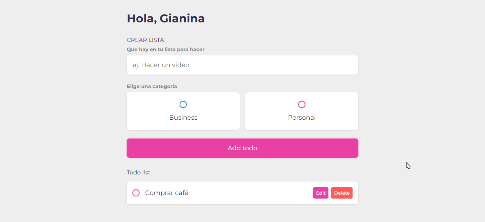

# TODO LIST

En esta lista podrás añadir la tarea y categorizarla como personal o trabajo, luego puedes marcarla como tarea realizada, editarla o borrarla.

  

  
  
  

  

[Link al proyecto](https://gianinalc.github.io/todo-list/)
