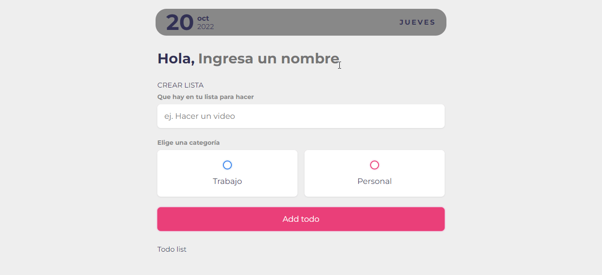

# TODO LIST

Esta Todo List permite guardar tus tareas en el navegador.

Puedes crear una nueva tarea, categorizarla, guardarla y si es necesario editarla también.

No podrás guardar una tarea vacía y sin categoría.

Una vez que hayas terminado, puedes marcarla como tarea realizada y posteriormente eliminarla. (Debe estar lista -done- para poder borrarla)

  

  
  
  

  

[Link al proyecto](https://gianinalc.github.io/todo-list/)
